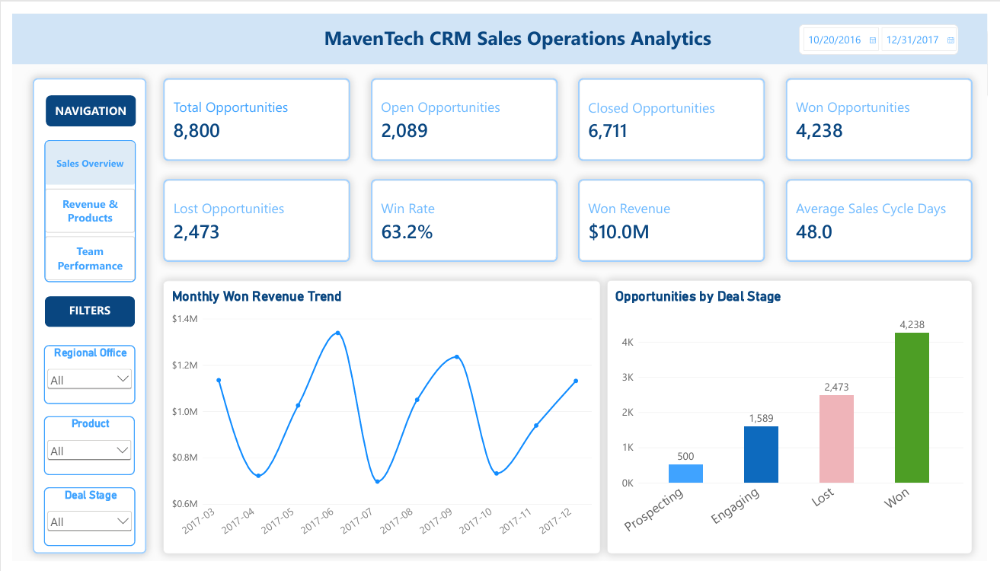
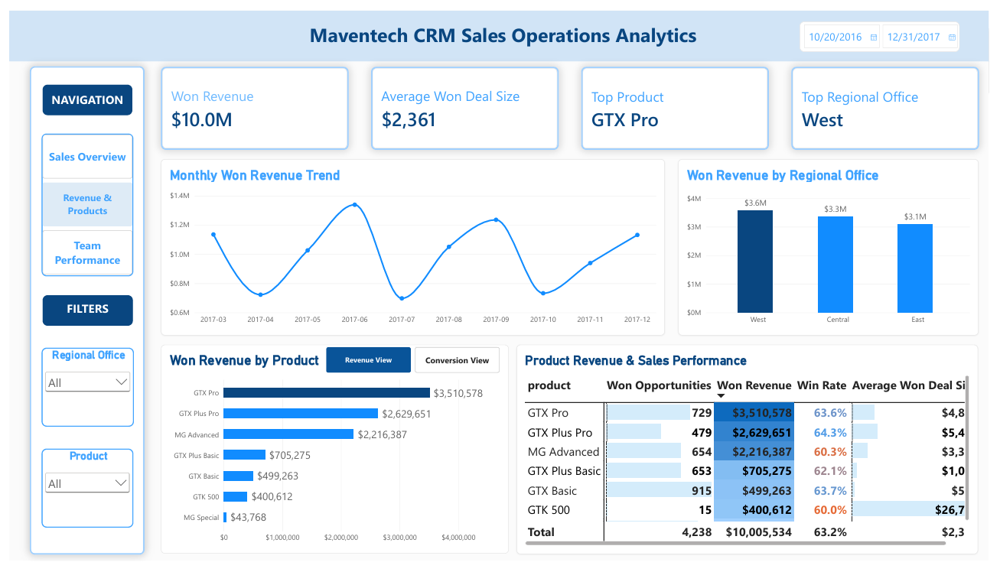
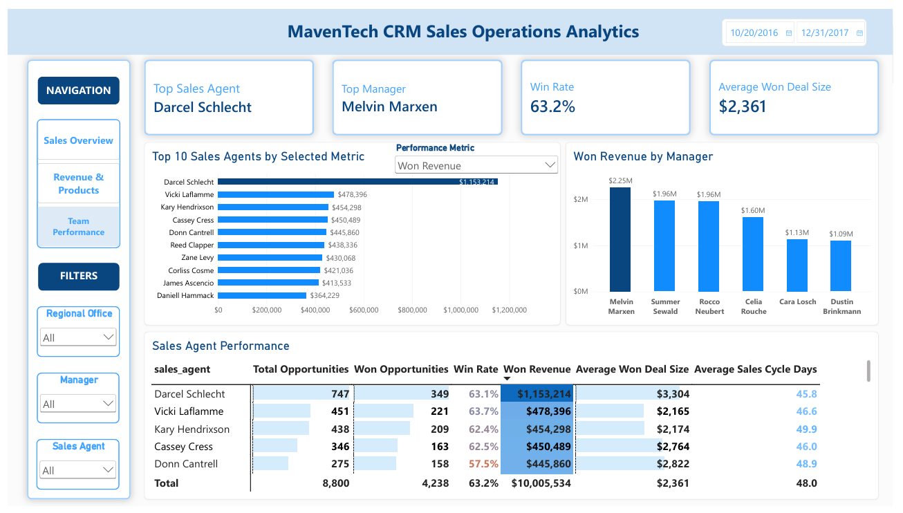

# MavenTech CRM Sales Operations Analysis

**Portfolio Project:** CRM Sales Operations & Business Intelligence | Power BI

**Dataset:** Maven Analytics CRM Sales Opportunities

## Project Overview

This portfolio project analyzes MavenTech CRM sales opportunity data to transform raw pipeline records into management-ready insights for sales operations decision-making.

The analysis evaluates sales opportunities, conversion performance, won revenue, average deal size, sales-cycle efficiency, product performance, regional performance, and sales team performance. An interactive Power BI dashboard was developed to help management identify performance trends, compare revenue and conversion outcomes, investigate performance gaps, and support data-driven decisions.

## Business Problem

Raw CRM opportunity records do not provide leadership with a consolidated view of sales performance. Management needs to connect pipeline outcomes with revenue, products, regions, teams, deal size, and sales-cycle efficiency.

A single KPI can also hide important trade-offs. For example, a high conversion rate does not necessarily correspond to high revenue. This project brings multiple performance measures together to provide a more complete analytical perspective.

## Management Questions

- Where is won revenue being generated, and where is it concentrated?
- Which products perform best by revenue versus conversion?
- Which regions, managers, and sales agents lead performance?
- Where are lost opportunities, longer sales cycles, or performance gaps creating risk?
- What should management investigate and improve next?

## Tools & Technologies

- Power BI
- Power Query
- DAX
- Data Modeling
- Data Visualization
- CRM Sales Analytics
- Sales Operations Analytics
- KPI Analysis
- Business Intelligence
- Business Presentation

## Dataset

The project uses the **Maven Analytics CRM Sales Opportunities** dataset.

The Power BI data model integrates:

- Sales pipeline
- Accounts
- Products
- Sales teams
- Calendar / date dimension

These tables were connected through relationships to support analysis across opportunities, customers, products, sales representatives, managers, regional offices, and time.

## Key KPIs

The dashboard evaluates several core sales performance measures, including:

- Total Opportunities
- Won Opportunities
- Win Rate
- Won Revenue
- Average Won Deal Size
- Average Sales Cycle Days

These KPIs provide complementary views of sales volume, conversion, revenue generation, deal value, and sales-cycle efficiency.

## Power BI Dashboard

The Power BI report provides three interactive analytical views designed to support executive monitoring, product and revenue analysis, and sales team performance evaluation.

### 1. Executive Sales Overview

Provides a management-level view of overall sales performance, including key KPIs, monthly won revenue trends, product performance, regional performance, and detailed sales-agent results.

### 2. Revenue & Product Performance

Provides a deeper view of revenue, product, and conversion performance, allowing users to compare business outcomes across products and regional offices using interactive analytical features.

### 3. Sales Team Performance

Evaluates sales-agent and management performance across multiple KPIs, helping users identify stronger results, performance gaps, and areas requiring further investigation.

## Advanced Power BI Features

The dashboard incorporates advanced interactive and analytical functionality designed to improve usability, support flexible analysis, and help users move efficiently from high-level KPIs to detailed performance insights.

- **DAX Measures** – Developed reusable measures for revenue, win rate, opportunity performance, average deal size, sales-cycle efficiency, rankings, and other business KPIs.
- **Data Modeling** – Built relationships across sales pipeline, account, product, sales team, and calendar tables to support consistent cross-functional analysis.
- **Interactive Slicers** – Enabled users to filter the dashboard by Sales Agent, Regional Office, Product, Sector, and Date for targeted analysis.
- **Reset Filters Button** – Created a one-click reset function that restores dashboard slicers to their default state, improving navigation and user experience.
- **Bookmarks & Bookmark Navigation** – Developed alternate analytical views that allow users to switch between revenue and conversion perspectives without navigating to another report page.
- **Field Parameters & Dynamic Metric Selection** – Enabled users to dynamically analyze Revenue, Won Opportunities, Win Rate, Average Deal Size, and Average Sales Cycle Days within shared visuals.
- **Dynamic Chart Titles** – Configured chart titles to automatically update based on the selected metric, helping users immediately understand the analytical context of each view.
- **Drill-Through Analysis** – Added drill-through functionality that allows users to move from summary-level performance results to more detailed analysis while preserving relevant filter context.
- **Conditional Formatting** – Applied performance-based formatting to analytical matrices to make higher and lower results easier to identify.
- **Analytical Matrices** – Combined multiple KPIs into detailed management views for comparing agents, managers, revenue, conversion, deal size, and sales-cycle performance.
- **Report-Page Tooltips** – Created contextual tooltip views that provide additional performance details without requiring users to leave the primary report page.
- **Top-N Analysis** – Implemented dynamic Top 10 analysis to focus attention on leading sales performance.
- **Dynamic Agent Selection** – Used dynamic report elements to reflect the selected sales agent and provide more contextual analysis.
- **Cross-Filtered Analysis** – Designed report interactions so multiple slicers and visuals can work together to support deeper performance investigation.

These features were implemented to serve practical analytical and decision-support purposes rather than function only as visual enhancements. Together, they allow users to move between executive-level performance monitoring and more detailed diagnostic analysis within an interactive Power BI environment.

## Power BI Dashboard Walkthrough

A focused walkthrough demonstrates how users can interact with the Power BI dashboard to explore sales performance and move from executive-level KPIs to more detailed analysis.

The walkthrough highlights key interactive capabilities, including slicers, the Reset Filters button, bookmarks, field parameters, dynamic metric selection, dynamic chart titles, drill-through analysis, conditional formatting, analytical matrices, and report-page tooltips.

**Dashboard Walkthrough:** [Watch the Power BI Dashboard Walkthrough](PASTE-DASHBOARD-WALKTHROUGH-LINK-HERE)

## Business Analysis Presentation

A complete business presentation accompanies the dashboard and explains the analytical approach, business problem, management questions, dashboard functionality, key findings, and data-driven recommendations.

The presentation also demonstrates how interactive Power BI capabilities can support different management perspectives and improve the user experience.

**Video Presentation:** [Watch the MavenTech CRM Sales Operations Analysis](https://youtu.be/erOpEE_5N8A?si=3eCXSc_QauZL29b-)

## Skills Demonstrated

This project demonstrates practical experience in:

- CRM sales data analysis
- Sales operations analytics
- Power BI dashboard development
- DAX measure development
- Data modeling
- KPI design and interpretation
- Revenue and conversion analysis
- Product and regional performance analysis
- Sales team performance analysis
- Interactive business intelligence
- Data visualization
- Business storytelling
- Translating analytical findings into management recommendations

## Portfolio Project

**Created and presented by Tina Vo**

This project was developed for educational and professional portfolio demonstration purposes.
