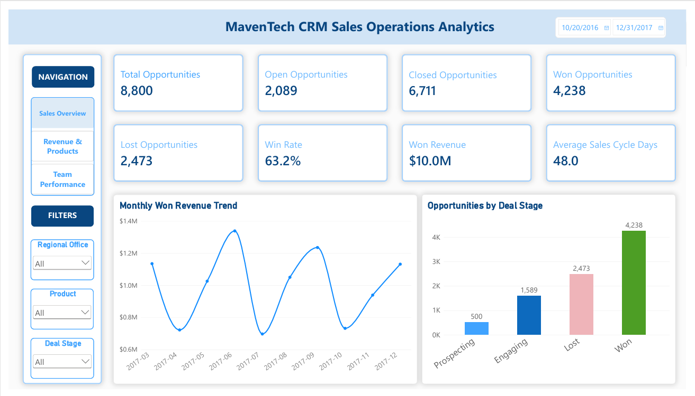
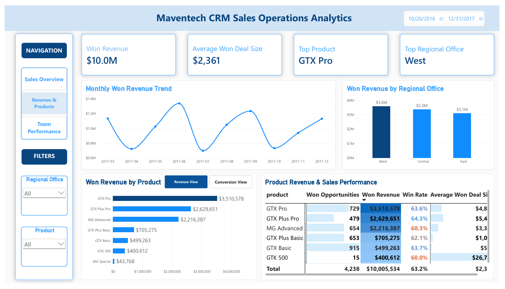
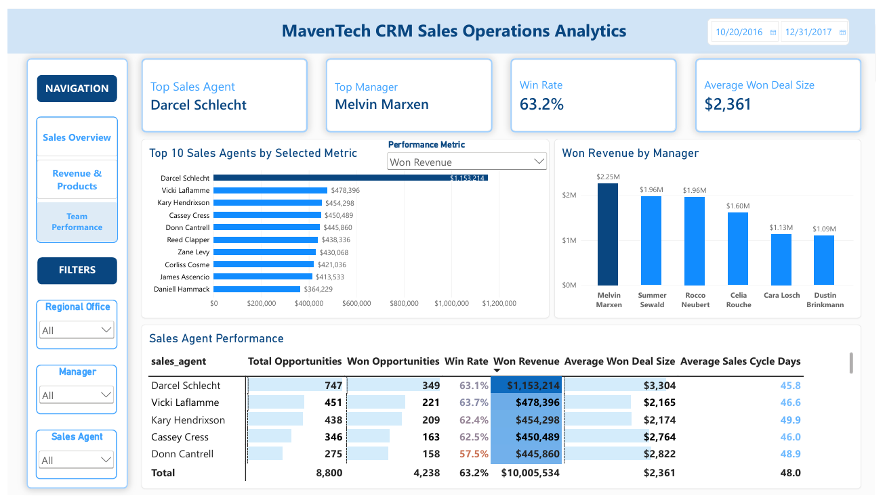
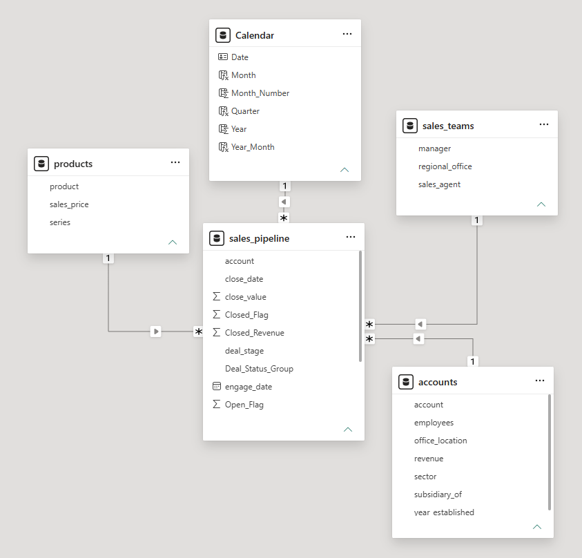
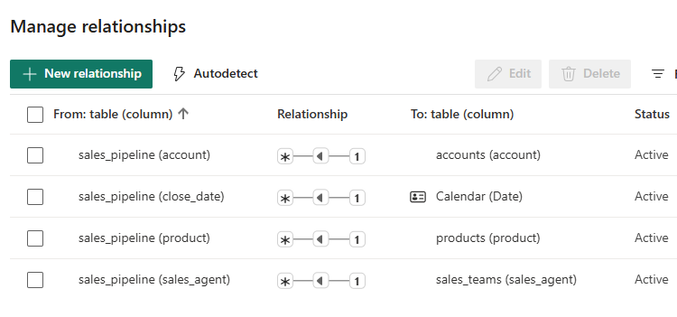

# 📊 Power BI Dashboard — MavenTech CRM Sales Operations Analytics

This folder contains three Power BI dashboard screenshots and two data-model screenshots for Project #2. The dashboard transforms CRM sales opportunity data into actionable insights across **sales performance, revenue, products, regions, and sales teams**.

## 📊 Dashboard Report Pages

### 1. Executive Sales Overview

Monitors sales opportunities, win rate, won revenue, average deal size, and sales cycle performance.

### 2. Revenue & Product Performance

Analyzes revenue contribution, product performance, regional results, and sales conversion patterns.

### 3. Sales Team Performance

Evaluates sales agent performance using dynamic metrics, rankings, and interactive comparisons.

---

## 🏗️ Power BI Data Model

Integrates CRM sales opportunities with account, product, sales team, and calendar dimensions to support consistent analytical reporting.

### 🔗 Relationship Details

The relational model supports filtering and analysis across sales agents, regions, products, accounts, and reporting periods.

---

## 🔍 Key Analytical Insights

- **Sales performance:** Tracks revenue, win rates, deal values, and sales cycle efficiency.
- **Revenue drivers:** Identifies product and regional contributions to won revenue.
- **Sales team effectiveness:** Enables agent-level performance comparisons and KPI exploration.
- **Management visibility:** Connects executive KPIs with detailed product, regional, and sales team analysis.

---

[⬅️ Back to Main Project README](../README.md)
